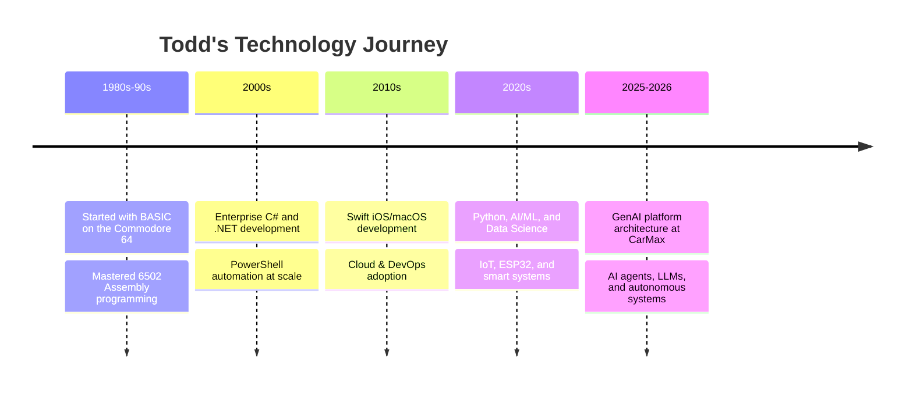

<div align="center">

<<<<<<< Updated upstream
<<<<<<< Updated upstream
<!-- Header -->


<h3>Sr Architect AI/ML & Developer Engineer</h3>

<!-- Main CTA -->
<a href="https://www.thedubes.com">
  
</a>

<br><br>

<!-- Links -->
<a href="https://www.thedubes.com"></a>
<a href="https://www.linkedin.com/in/tdube/"></a>
<a href="https://github.com/todddube"></a>


<br><br>


</div>

---

<div align="center">

### Featured Projects

| Project | Description |
|---------|-------------|
| [todddube](https://github.com/todddube/todddube) | Todd Dube |
| [retrosvr](https://github.com/todddube/retrosvr) | Retro Screen Saver for Windows |
| [vstat](https://github.com/todddube/vstat) | Claude Status Extension |
| [wthrr](https://github.com/todddube/wthrr) | wthrr app |

<br>

<a href="https://www.thedubes.com"></a>
=======
<!-- Dynamic Header -->


<!-- Typing Animation -->


=======
<!-- Dynamic Header -->


<!-- Typing Animation -->


>>>>>>> Stashed changes
<!-- Social Links -->
<p align="center">
  <a href="https://www.linkedin.com/in/tdube/">
    
  </a>
  <a href="https://github.com/todddube">
    
  </a>
  
  
</p>

<!-- Interest Badges -->
<p align="center">
  
  
  
  
</p>

</div>

---

## 🚀 About Me

<div align="center">
<table>
<tr>
<td width="55%">

### 👨‍💻 Who Am I?

**Sr Solutions Architect** specializing in **Data Science, AI/ML, GenAI & Data Analytics Platforms** at [CarMax](https://www.carmax.com) — and a lifelong builder, tinkerer, and game developer.

I believe in understanding technology from first principles: from hand-crafting 6502 Assembly on a Commodore 64 to architecting enterprise-scale GenAI platforms. Richmond, VA.

#### 🎯 Currently Building:
- 🤖 **GenAI & AI Agent Systems** — autonomous agents, LLM workflows, Claude integrations
- 📊 **Data Analytics Platforms** — enterprise-scale data science at CarMax
- 🎮 **Games** — iOS space shooters, C++ lunar lander, C64 Assembly titles
- 💡 **IoT & LED Projects** — NightDriver ESP32 LED displays, smart systems

</td>
<td width="45%">

</td>
</tr>
</table>
</div>

<!-- Tech Journey -->
<details>
<summary><b>🛤️ My Tech Journey</b></summary>
<br>



</details>

---

## 🛠️ Tech Stack & Arsenal

<div align="center">

<!-- Primary Languages -->


<!-- Frameworks & Tools -->


### Core Expertise

<table>
<tr>
<td align="center" width="16%">
<br>
<strong>Python</strong><br><sub>AI/ML · GenAI · Automation</sub>
</td>
<td align="center" width="16%">
<br>
<strong>C#</strong><br><sub>.NET · Enterprise</sub>
</td>
<td align="center" width="16%">
<br>
<strong>Swift</strong><br><sub>iOS · macOS · SpriteKit</sub>
</td>
<td align="center" width="16%">
<br>
<strong>C / C++</strong><br><sub>Games · Systems</sub>
</td>
<td align="center" width="16%">
<br>
<strong>PowerShell</strong><br><sub>DevOps · Automation</sub>
</td>
<td align="center" width="16%">
<br>
<strong>Assembly</strong><br><sub>6502 · C64 · Retro</sub>
</td>
</tr>
</table>

### Specialized Domains

<p align="center">
  
  
  
  
  
</p>

<details>
<summary><b>📊 Proficiency Levels</b></summary>
<br>

**Languages:**
```
Python       ████████████████████ 100%
C#           ██████████████████░░  90%
PowerShell   █████████████████░░░  85%
Swift        ███████████████░░░░░  75%
C / C++      █████████████░░░░░░░  65%
Assembly     ████████████░░░░░░░░  60%
JavaScript   ████████████░░░░░░░░  60%
```

**Domains:**
```
AI/ML & GenAI     ████████████████████ 100%
Data Science      ██████████████████░░  90%
Game Development  ███████████████░░░░░  75%
DevOps & Cloud    ██████████████░░░░░░  70%
IoT & Hardware    ████████████░░░░░░░░  60%
```

</details>

</div>

---

<div align="center">
  <picture>
    <source media="(prefers-color-scheme: dark)" srcset="https://raw.githubusercontent.com/todddube/todddube/output/github-contribution-grid-snake-dark.svg" />
    <source media="(prefers-color-scheme: light)" srcset="https://raw.githubusercontent.com/todddube/todddube/output/github-contribution-grid-snake.svg" />
    
  </picture>
</div>

---

## 🚀 Featured Projects

<div align="center">

<table>
<tr>
<td width="33%" align="center">

### 🤖 AI & GenAI


[](https://github.com/todddube/agentic)
<br><sub>Autonomous AI agent experiments</sub>

[](https://github.com/todddube/agentic_demo)
<br><sub>AI agent demonstration systems</sub>

[](https://github.com/todddube/claude)
<br><sub>Claude AI experiments & integrations</sub>

[](https://github.com/todddube/opencodekmx)
<br><sub>Open source coding agent</sub>

</td>
<td width="33%" align="center">

### 🎮 Games & Interactive


[](https://github.com/todddube/spacequest-ios)
<br><sub>Full iOS space shooter game</sub>

[](https://github.com/todddube/lander)
<br><sub>Lunar lander in C++</sub>

[](https://github.com/todddube/2048-In-Python)
<br><sub>Python 2048 implementation</sub>

[](https://github.com/todddube/Flappy-bird-python)
<br><sub>Classic game recreation</sub>

</td>
<td width="33%" align="center">

### 💾 Retro Computing (C64)


[](https://github.com/todddube/retaliate64)
<br><sub>6502 Assembly space shooter remake</sub>

[](https://github.com/todddube/tetris.c64)
<br><sub>Tetris in 6502 for the C64</sub>

[](https://github.com/todddube/City-Bomber-C64-Asm)
<br><sub>City Bomber for Commodore 64</sub>

[](https://github.com/todddube/C64-Projects)
<br><sub>Collection of C64 Assembly projects</sub>

</td>
</tr>
<tr>
<td width="33%" align="center">

### 🌐 IoT & Hardware


[](https://github.com/todddube/NightDriverStrip)
<br><sub>NightDriver LED client for ESP32</sub>

[](https://github.com/todddube/audio_spec)
<br><sub>Real-time audio spectrum visualizer</sub>

[](https://github.com/todddube/wthrr)
<br><sub>C++ real-time weather display</sub>

</td>
<td width="33%" align="center">

### 🔧 Tools & Utilities


[](https://github.com/todddube/vstat)
<br><sub>Claude AI status browser extension</sub>

[](https://github.com/todddube/retrosvr)
<br><sub>Retro screen saver for Windows</sub>

[](https://github.com/todddube/powershell)
<br><sub>System automation scripts</sub>

[](https://github.com/todddube/docker)
<br><sub>Docker configuration scripts</sub>

</td>
<td width="33%" align="center">

### 💡 Fun Facts
<br>

🎯 **Multi-Era Coder**
Hand-crafts 6502 Assembly AND builds enterprise GenAI platforms

🚀 **Project Range**
From ESP32 LED strips to enterprise-scale data analytics

☕ **Coffee → Code**
Converting caffeine into commits since 2011

🎮 **Gaming Legacy**
Games on 8-bit C64 *and* modern Swift & C++

💾 **Digital Archaeology**
Preserving retro computing history, one repo at a time

</td>
</tr>
</table>

</div>

---

## 📊 GitHub Analytics

<div align="center">

<table>
<tr>
<td width="50%">

### 📈 Contribution Stats
<picture>
  <source srcset="https://github-readme-stats.vercel.app/api?username=todddube&show_icons=true&theme=radical&border_color=30A3DC&bg_color=0D1117&icon_color=00D4AA&title_color=00D4AA&include_all_commits=true&count_private=true" media="(prefers-color-scheme: dark)"/>
  <source srcset="https://github-readme-stats.vercel.app/api?username=todddube&show_icons=true&theme=default&border_color=30A3DC&include_all_commits=true" media="(prefers-color-scheme: light)"/>
  
</picture>

</td>
<td width="50%">

### 🎯 Language Distribution
<picture>
  <source srcset="https://github-readme-stats.vercel.app/api/top-langs/?username=todddube&layout=compact&theme=radical&border_color=30A3DC&bg_color=0D1117&title_color=00D4AA&langs_count=8" media="(prefers-color-scheme: dark)"/>
  <source srcset="https://github-readme-stats.vercel.app/api/top-langs/?username=todddube&layout=compact&theme=default&border_color=30A3DC&langs_count=8" media="(prefers-color-scheme: light)"/>
  
</picture>

</td>
</tr>
</table>

### 🏆 GitHub Achievements


### 🔥 Contribution Streak


### 📊 Contribution Activity


</div>

---

## 🤝 Let's Connect

<div align="center">

<table>
<tr>
<td align="center">
<a href="https://www.linkedin.com/in/tdube/">

<br><strong>LinkedIn</strong>
<br><sub>Professional Network</sub>
</a>
</td>
<td align="center">
<a href="https://github.com/todddube">

<br><strong>GitHub</strong>
<br><sub>Code & Projects</sub>
</a>
</td>
</tr>
</table>

### 💬 Open to Collaborating On:

<p align="center">
  
  
  
  
  
</p>

<blockquote>
💡 <em>"From 6502 Assembly on a Commodore 64 to architecting GenAI platforms — I bridge decades of computing evolution. Whether it's retro, modern, or cutting-edge AI, let's build something remarkable together."</em>
</blockquote>

---

<!-- Footer -->


<details>
<summary><b>🙏 Powered By</b></summary>
<br>

- 📊 [GitHub Readme Stats](https://github.com/anuraghazra/github-readme-stats)
- ⌨️ [Readme Typing SVG](https://github.com/DenverCoder1/readme-typing-svg)
- 🎨 [Skill Icons](https://skillicons.dev/)
- 🏆 [GitHub Profile Trophy](https://github.com/ryo-ma/github-profile-trophy)
- 🔥 [GitHub Readme Streak Stats](https://github.com/DenverCoder1/github-readme-streak-stats)
- 🌊 [Capsule Render](https://github.com/kyechan99/capsule-render)
- 🐍 [GitHub Snake Animation](https://github.com/Platane/snk)
<<<<<<< Updated upstream
>>>>>>> Stashed changes
=======
>>>>>>> Stashed changes

</div>

<<<<<<< Updated upstream
<<<<<<< Updated upstream
---

<div align="center">

<picture>
  <source media="(prefers-color-scheme: dark)" srcset="https://raw.githubusercontent.com/todddube/todddube/output/github-contribution-grid-snake-dark.svg" />
  <source media="(prefers-color-scheme: light)" srcset="https://raw.githubusercontent.com/todddube/todddube/output/github-contribution-grid-snake.svg" />
  
</picture>

<br><br>

<sub>From 6502 Assembly to AI — Four decades of innovation</sub>

<br>


=======
<sub>⚡ Profile auto-updated via GitHub Actions</sub>

>>>>>>> Stashed changes
=======
<sub>⚡ Profile auto-updated via GitHub Actions</sub>

>>>>>>> Stashed changes
</div>
