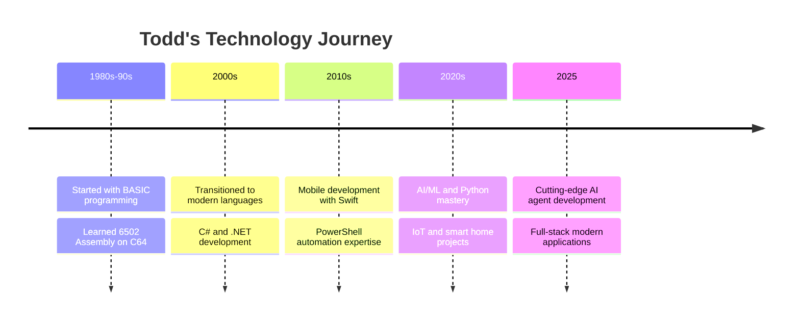

<!-- Professional Header with Brand Identity -->

<!-- Enhanced Typing Animation with Professional Branding -->

<!-- Professional Links and Contact -->

  
  
  
  

<!-- Expertise Highlights -->

  
  
  
  

## ⭐ Key Projects

---

### 📊 **VStat - Visual Statistics Dashboard** ⭐ Featured Project

  

**Real-time visual statistics and monitoring dashboard**

  
  

---

### 🎯 Additional Key Projects

#### 🤖 **Ai**

*Building intelligent conversational systems and autonomous AI agents*

#### 💡 **Iot**

*Philips Hue SDK integration for smart lighting automation*

#### 🚀 **Gaming**

*Featured macOS space adventure game built with Swift and SpriteKit*

#### 💾 **Retro**

*Retro computing with 6502 Assembly on Commodore 64*

---

  💡 <em>Projects are maintained and regularly updated • More projects available in the <a href="#featured-projects--digital-creations">Complete Portfolio</a> section below</em>

---

## 🚀 About Me
🕐 *Last updated: December 22, 2025 at 03:04 AM EST*

  <table style="border: none;">
    <tr>
      <td width="50%" style="border: none;">
        <h3>👨‍💻 Who Am I?</h3>
        
I'm a <strong>Senior Technology Professional & Full-Stack Developer</strong> 🌟 with extensive experience bridging traditional computing foundations with cutting-edge innovations. From classic 6502 assembly to modern AI/ML frameworks, I believe in understanding technology from the ground up.

        <h4>🎯 Currently Working On:</h4>
        <ul>
          <li>🤖 <strong>AI Agent Development</strong> - Building intelligent conversational systems</li>
          <li>🌐 <strong>IoT Integration</strong> - Smart home automation with Philips Hue</li>
          <li>🎮 <strong>Game Development</strong> - Swift & Python gaming projects</li>
          <li>💾 <strong>Retro Computing</strong> - C64 Assembly programming</li>
        </ul>
      </td>
      <td width="50%" style="border: none;">
        
      </td>
    </tr>
  </table>

<!-- Professional Journey Timeline -->

<b>🛤️ My Tech Journey</b>

 

<!-- Interactive Skills Showcase -->

### 🛠️ Core Technologies & Expertise

<table>
<tr>
<td align="center" width="20%">

 <strong>Python</strong>
 AI/ML, Automation
</td>
<td align="center" width="20%">

 <strong>C#</strong>
 .NET Development
</td>
<td align="center" width="20%">

 <strong>Swift</strong>
 iOS/macOS Apps
</td>
<td align="center" width="20%">

 <strong>PowerShell</strong>
 DevOps & Automation
</td>
<td align="center" width="20%">

 <strong>Assembly</strong>
 6502 Retro Computing
</td>
</tr>
</table>

### 🎯 Specialized Areas

  
  
  
  

### 📊 Quick Stats:
- 📂 **19** Public Repositories
- 👥 **7** GitHub Followers
- 🔗 **13** Following
### 💡 Fun Facts About Me

<table>
<tr>
<td align="center">🎯</td>
<td><strong>Multi-Era Coder:</strong> I can write 6502 Assembly AND modern Python AI frameworks</td>
</tr>
<tr>
<td align="center">🚀</td>
<td><strong>Project Range:</strong> From IoT smart home solutions to retro C64 games</td>
</tr>
<tr>
<td align="center">☕</td>
<td><strong>Coffee2Code:</strong> Turning caffeine into code across multiple decades of computing!</td>
</tr>
<tr>
<td align="center">🎮</td>
<td><strong>Gaming Legacy:</strong> Built games on both 8-bit computers and modern Swift frameworks</td>
</tr>
</table>

## 🎨 Tech Stack & Digital Arsenal

<!-- Modern Tech Stack Visualization -->

### 🤖 AI & Machine Learning Toolkit

  
  
  
  
  

### 🎮 Game Development Arsenal

  
  
  
  

### 🌐 Development & DevOps

  

<!-- Interactive Tech Meter -->

<b>📊 Technology Proficiency Levels</b>

 

**Programming Languages:**
- 🐍 Python: ████████████████████ 100%
- 🟦 C#: ██████████████████░░ 90%
- 🍎 Swift: ███████████████░░░░░ 75%
- ⚡ PowerShell: █████████████████░░░ 85%
- 💾 Assembly (6502): ████████████░░░░░░░░ 60%

**Frameworks & Tools:**
- 🤖 AI/ML: ██████████████████░░ 90%
- 🎮 Game Development: ███████████████░░░░░ 75%
- 🌐 Web Development: ████████████░░░░░░░░ 65%
- 🔧 DevOps: ██████████████░░░░░░ 70%

  <picture>
    <source media="(prefers-color-scheme: dark)" srcset="https://raw.githubusercontent.com/todddube/todddube/output/github-contribution-grid-snake-dark.svg" />
    <source media="(prefers-color-scheme: light)" srcset="https://raw.githubusercontent.com/todddube/todddube/output/github-contribution-grid-snake.svg" />
    
  </picture>

## 🚀 Featured Projects & Digital Creations

<!-- Modern Project Showcase with Cards -->
<table>
<tr>
<td width="33%" align="center">

### 🤖 AI & Machine Learning

*Building intelligent conversational systems and autonomous AI agents*

*Advanced AI experiments and integrations*

</td>
<td width="33%" align="center">

### 🌐 IoT & Smart Systems

*Philips Hue SDK integration for smart lighting automation*

*Real-time weather data visualization*

</td>
<td width="33%" align="center">

### 🎮 Gaming & Retro Computing

*Featured macOS space adventure game*

*Retro computing with 6502 Assembly*

</td>
</tr>
</table>

<!-- Interactive Project Gallery -->

<b>🎨 Complete Project Portfolio</b>

 

<table>
<tr>
<td align="center" width="25%">
<a href="https://github.com/todddube/python">

 <strong>Python Toolkit</strong>
</a>
 Development utilities & automation
</td>
<td align="center" width="25%">
<a href="https://github.com/todddube/2048-In-Python">

 <strong>2048 Game</strong>
</a>
 Python implementation with AI
</td>
<td align="center" width="25%">
<a href="https://github.com/todddube/Flappy-bird-python">

 <strong>Flappy Bird</strong>
</a>
 Classic game recreation
</td>
<td align="center" width="25%">
<a href="https://github.com/todddube/powershell">

 <strong>PowerShell Scripts</strong>
</a>
 System automation toolkit
</td>
</tr>
</table>

<!-- Project Spotlight Section -->

### 🌟 Project Spotlight

<table>
<tr>
<td align="center">

#### 🚀 **SpaceRunner** - *Flagship Game*

**The Ultimate Swift Space Adventure!**
- Built with SwiftUI & SpriteKit for native macOS performance
- Dynamic gameplay with stunning visuals and immersive sound
- Showcases advanced game development techniques
- **Status:** Active development with regular updates

</td>
<td align="center">

#### 🤖 **AI Agent Development** - *Innovation*

**Intelligent Conversational Systems**
- Advanced AI agent development and demonstrations
- Claude AI integration and experimentation
- Autonomous system design and implementation
- **Focus:** Next-generation AI interactions

</td>
</tr>
</table>

<!-- Legacy & Modern Bridge -->
### 💾 ➡️ 🤖 From Retro to AI

 **My unique journey spans from 6502 Assembly on Commodore 64 to cutting-edge AI development - bridging decades of computing evolution!**

### 🔥 Recent Activity:
- 📁 **[todddube](https://github.com/todddube/todddube)** - Todd Dube
- ⚡ **[wthrr](https://github.com/todddube/wthrr)** - wthrr app
- 💙 **[tailergater](https://github.com/todddube/tailergater)** ⭐ 1 - Tail Gate Planner

## 📊 GitHub Analytics & Achievements

<!-- Modern Stats Layout -->
<table>
<tr>
<td width="50%">

### 📈 **Contribution Stats**
<picture>
  <source srcset="https://github-readme-stats.vercel.app/api?username=todddube&show_icons=true&theme=radical&border_color=30A3DC&bg_color=0D1117&icon_color=00D4AA&title_color=00D4AA" media="(prefers-color-scheme: dark)"/>
  <source srcset="https://github-readme-stats.vercel.app/api?username=todddube&show_icons=true&theme=default&border_color=30A3DC" media="(prefers-color-scheme: light)"/>
  
</picture>

</td>
<td width="50%">

### 🎯 **Language Distribution**
<picture>
  <source srcset="https://github-readme-stats.vercel.app/api/top-langs/?username=todddube&layout=compact&theme=radical&border_color=30A3DC&bg_color=0D1117&title_color=00D4AA" media="(prefers-color-scheme: dark)"/>
  <source srcset="https://github-readme-stats.vercel.app/api/top-langs/?username=todddube&layout=compact&theme=default&border_color=30A3DC" media="(prefers-color-scheme: light)"/>
  
</picture>

</td>
</tr>
</table>

<!-- Enhanced Trophies -->
### 🏆 **GitHub Achievements**

<!-- Streak Stats -->
### 🔥 **Contribution Streak**

<!-- Activity Graph -->
### 📊 **Contribution Activity**

## 🤝 Let's Connect & Build Something Amazing!

<!-- Modern Contact Section -->

### 🌐 **Professional Network**

<table>
<tr>
<td align="center">
<a href="https://www.linkedin.com/in/tdube/">

 <strong>LinkedIn</strong>
 Professional Network
</a>
</td>
<td align="center">
<a href="https://github.com/todddube">

 <strong>GitHub</strong>
 Code & Projects
</a>
</td>
<td align="center">
<a href="mailto:todd@example.com">

 <strong>Email</strong>
 Direct Contact
</a>
</td>
</tr>
</table>

### 💬 **Let's Collaborate On:**

  
  
  
  

<!-- Interactive Quote -->
<blockquote>
💡 <em>"From 6502 Assembly to AI - I bridge the gap between computing's past and future. Let's build something incredible together!"</em>
</blockquote>

<!-- Website Banner -->

  

---

<!-- Modern Footer -->

<!-- Credits & Updates -->

<b>🙏 Credits & Acknowledgments</b>

 

**Powered by amazing open-source projects:**
- 📊 [GitHub Readme Stats](https://github.com/anuraghazra/github-readme-stats) - Dynamic statistics
- ⌨️ [Readme Typing SVG](https://github.com/DenverCoder1/readme-typing-svg) - Animated typing
- 🎨 [Skill Icons](https://skillicons.dev/) - Beautiful tech icons
- 🏆 [GitHub Profile Trophy](https://github.com/ryo-ma/github-profile-trophy) - Achievement system
- 🔥 [GitHub Readme Streak Stats](https://github.com/DenverCoder1/github-readme-streak-stats) - Contribution streaks
- 🌊 [Capsule Render](https://github.com/kyechan99/capsule-render) - Dynamic headers/footers

  🕐 <em>Profile auto-updated via GitHub Actions • Last refresh: September 21, 2025</em>

